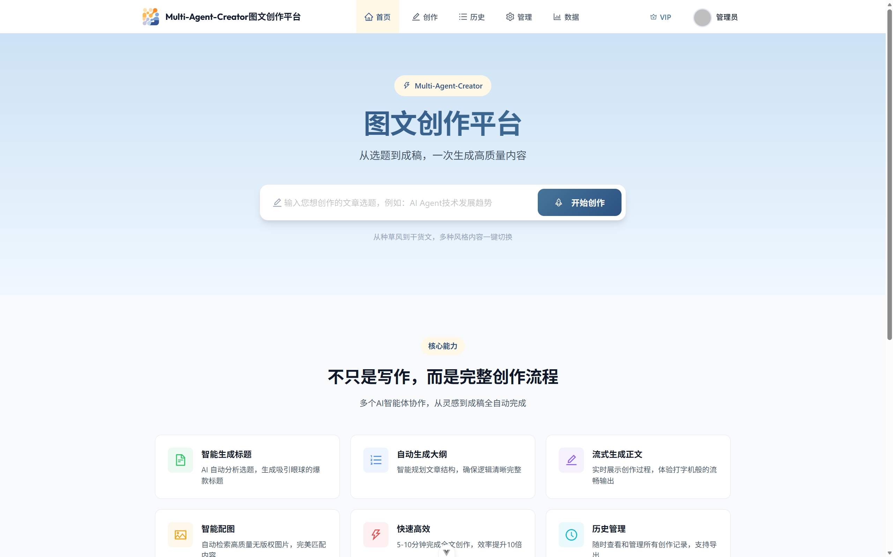
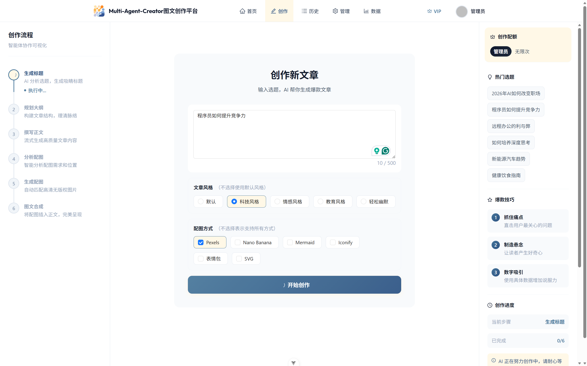
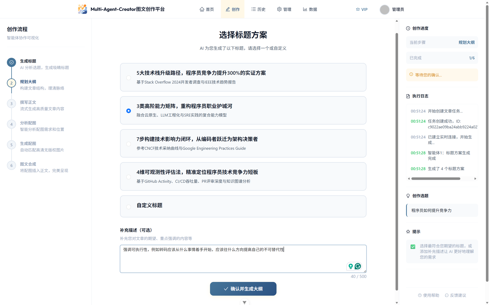
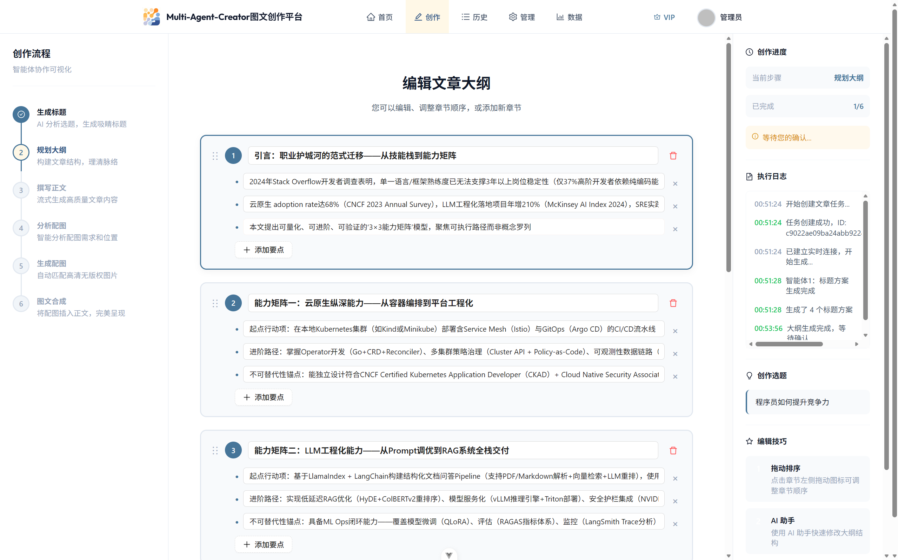
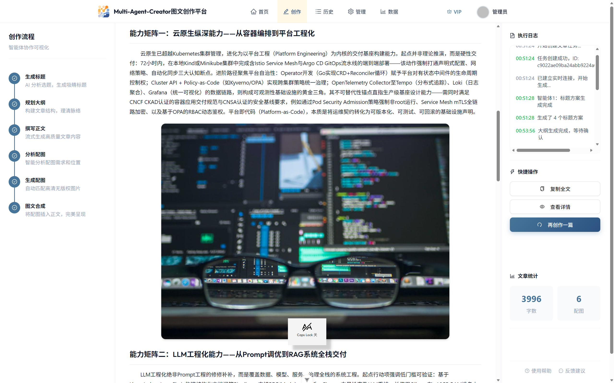

# Multi-Agent-Creator：基于 Spring AI + RAG 的多智能体图文创作平台

<div align="center">

</div>

## 🎯 项目简介

Multi-Agent-Creator 是针对自媒体内容创作中选题难、写作慢、配图成本高等痛点，基于 **Spring AI Alibaba** 框架构建的大模型应用。项目采用 **Multi-Agent 多智能体架构**，结合 **RAG（检索增强生成）** 技术，实现了从选题策划到图文内容生成的端到端创作闭环。

```
智能体1: 选题分析 → 生成候选标题 → 用户决策
智能体2: 标题解析 → 构建内容大纲 → 用户编辑 / AI优化
智能体3: 大纲展开 → 生成Markdown正文
智能体4: 内容分析 → 生成配图需求 → 多模态匹配
智能体5: 配图执行 → 图文智能合成 → 成品输出
```

## 🎨 用户界面展示

以下是应用的核心界面流程展示：

### 1. 首页界面
应用的主页面，提供清晰的功能导航和快速入口：



### 2. 主题输入
用户可以在此页面输入想要创作的文章主题，例如"程序员如何提升竞争力"：



### 3. 标题生成
系统基于用户输入的主题，自动生成多个备选标题供用户选择：



### 4. 大纲生成
根据用户选择的主题、标题以及补充的提示词，系统生成结构化的文章大纲：



### 5. 文章生成
最终生成的完整文章，包含丰富的配图和格式化的内容：



## 🎯 核心技术价值

| 特性 | 说明  |
|------|------|
| 🤖 Multi-Agent协同 | 5个专用智能体分工协作，StateGraph状态机编排  |
| 📚 RAG增强生成 | PGVector向量检索 + 查询重写优化  |
| 🎨 多模态配图 | 6种配图策略 + Tool Calling动态调度  |
| ⚡ 并行异步处理 | 线程池并行配图 + SSE流式输出  |
| 💎 Stripe支付集成 | 完整的商业化会员体系 |
| 🐳 云原生架构 | Docker容器化 + 微服务设计  |

## ✨ 核心功能特性

### Multi-Agent 智能体架构

| 智能体 | 职责 | 技术特点 |
|--------|------|----------|
| 标题生成器 | 选题分析 → 候选标题生成 | RAG增强 + 结构化输出 |
| 大纲构建器 | 标题解析 → 内容架构设计 | 流式输出 + Human-in-the-loop |
| 正文创作器 | 大纲展开 → Markdown生成 | 向量检索 + 上下文增强 |
| 配图分析器 | 内容语义分析 → 配图需求生成 | 多模态理解 + 结构化决策 |
| 图文整合器 | 配图执行 → 智能图文合成 | Tool Calling + 自动降级 |

### 多模态配图系统（Tool Calling + 策略模式）

基于Tool Calling实现动态配图服务调度，支持多种配图策略的智能选择与自动降级：

| 配图策略 | 技术实现 | 适用场景 |
|----------|--------|----------|
| Pexels图库 | 语义检索 + 关键词匹配 | 通用配图 |
| Mermaid图表 | AI Prompt生成 | 流程/架构图 |
| Iconify图标 | 图标库检索 | 装饰性图标 |
| 表情包搜索 | Bing图片API | 情感化配图 |
| Nano Banana | Gemini AI生成 | VIP专属生图 |
| SVG示意图 | AI概念图生成 | 技术示意图 |
| Picsum降级 | 随机图片服务 | 容错保障 |

> **配图系统性能**：平均配图时间4秒，整体成功率99%，支持并行处理和自动降级机制。

### RAG增强生成系统

基于PGVector构建向量检索知识库，通过多阶段优化提升生成质量：

- **查询重写**：优化用户输入，提升检索相关性
- **多查询扩展**：生成多个相关查询，提高召回率
- **上下文增强**：融合检索结果，提升生成准确性
- **语义匹配**：基于向量相似度进行内容匹配

### 实时交互体验（SSE + 异步处理）

基于Server-Sent Events实现多阶段实时进度推送：

| 阶段 | 消息类型 | 用户体验 |
|------|----------|----------|
| 标题生成 | `TITLE_GENERATED` | 实时显示候选标题 |
| 大纲构建 | `OUTLINE_STREAMING` | 逐段流式输出大纲 |
| 正文创作 | `CONTENT_STREAMING` | 实时Markdown生成 |
| 配图分析 | `IMAGE_ANALYSIS_DONE` | 配图需求确认 |
| 配图生成 | `IMAGE_GENERATED` | 单张图片生成完成 |
| 图文整合 | `MERGE_COMPLETED` | 最终作品输出 |

### 商业化功能

- ✅ 文章全生命周期管理（创建、编辑、删除、导出）
- ✅ Stripe支付集成（下单、Webhook、幂等性处理）
- ✅ 会员配额控制（基于Redis的配额管理）
- ✅ 智能体执行监控（AOP自动日志记录）
- ✅ 数据分析后台（ECharts可视化统计）

## 🚀 快速开始

### 环境要求

- JDK 21+（推荐OpenJDK 21）
- Node.js 18+（推荐LTS版本）
- MySQL 8.0+（支持PGVector扩展）
- Redis 7.x（用于缓存和配额管理）

### 1. 数据库初始化与配置

```bash
# 初始化基础表结构
mysql -uroot -p < sql/create_table.sql

# 执行增量更新脚本
mysql -uroot -p < sql/update_quota.sql
mysql -uroot -p < sql/add_phase_fields.sql
mysql -uroot -p < sql/add_article_style.sql
```

### 2. 环境配置

```bash
# 复制配置文件模板
cp src/main/resources/application-local.yml.example src/main/resources/application-local.yml
```

编辑 `application-local.yml`，配置核心服务：

```yaml
# AI服务配置（必需）
spring:
  ai:
    dashscope:
      api-key: your-dashscope-api-key  # 通义千问API

# 配图服务配置（必需）
pexels:
  api-key: your-pexels-api-key  # Pexels图库API

# 商业化功能配置（可选）
stripe:
  api-key: sk_test_xxx  # 支付集成
  webhook-secret: whsec_xxx  # Webhook验证

tencent:
  cos:
    secret-id: xxx  # 腾讯云对象存储
    secret-key: xxx
    region: ap-guangzhou
    bucket: your-bucket-name

# RAG向量数据库配置（可选）
pgvector:
  host: localhost
  port: 5432
  database: vector_db
  username: postgres
  password: password
```

### 3. 启动后端服务

```bash
# 编译并启动
mvn clean compile spring-boot:run

# 或使用开发模式（热重载）
mvn spring-boot:run -Dspring-boot.run.profiles=local
```

API文档地址：http://localhost:8567/api/doc.html

### 4. 启动前端服务

```bash
cd ./multi-agent-creator/

# 安装依赖
npm install

# 启动开发服务器
npm run dev

# 或构建生产版本
npm run build
npm run preview
```

前端访问地址：http://localhost:5173

## 🐳 容器化部署（生产推荐）

### 前置条件

- Docker 20.10+（支持BuildKit）
- Docker Compose v2.20+（支持Profiles）

### 一键部署流程

```bash
# 1. 配置环境变量
cp .env.example .env

# 2. 编辑配置文件（必需配置AI服务）
vim .env

# 3. 使用智能启动脚本
./start.sh

# 或直接使用Docker Compose
docker compose up -d --build
```


### 服务架构与端口

| 服务组件 | 端口 | 访问地址 | 说明 |
|----------|------|----------|------|
| 前端服务 | 80 | http://localhost | 用户界面 |
| 后端API | 8123 | http://localhost:8123/api | RESTful API |
| API文档 | 8123 | http://localhost:8123/api/doc.html | Swagger UI |
| 健康检查 | 8123 | http://localhost:8123/api/health | 服务状态 |


### 环境变量配置详解

| 变量名 | 默认值 | 说明 |
|--------|--------|------|
| DASHSCOPE_API_KEY | - | 通义千问API密钥 |
| PEXELS_API_KEY  | - | Pexels图库API密钥 |
| MYSQL_ROOT_PASSWORD  | 123456 | 数据库root密码 |
| REDIS_PASSWORD  | - | Redis访问密码 |
| STRIPE_API_KEY  | - | Stripe支付API密钥 |
| TENCENT_COS_SECRET_ID  | - | 腾讯云COS密钥ID |
| NANO_BANANA_API_KEY | - | AI生图服务密钥 |

**生产环境建议**：
- 使用Docker Secrets管理敏感信息
- 配置HTTPS反向代理（Nginx/Traefik）
- 启用Prometheus + Grafana监控
- 配置日志聚合（ELK Stack）

## 📁 系统架构设计

### 后端架构结构

后端按业务域切片组织。文章、图片、RAG 等核心业务代码放在各自领域包内，`controller`、`service`、`model`、`mapper` 等通用层短期保留，公共 DTO/VO/Entity 后续再按引用稳定情况逐步迁移。

```text
src/main/java/com/sxxian/multiagentcreator/
├── article/                         # 文章生成域
│   ├── application/                  # 应用层入口、任务生命周期、SSE 事件发布
│   │   ├── ArticleGenerationApplicationService.java
│   │   └── ArticleGenerationEventPublisher.java
│   ├── workflow/                     # 文章生成流程编排
│   │   ├── OrchestratedArticleWorkflow.java
│   │   ├── ContentMergeService.java
│   │   └── legacy/
│   │       └── LegacyArticleWorkflow.java
│   ├── agent/                        # 真正 LLM 决策型文章 Agent
│   │   └── ArticleAgent.java
│   └── review/                       # 内容、配图计划、图片结果评审
│       └── ReviewAgent.java
├── image/                           # 图片域
│   ├── planning/                     # 图片规划与失败重规划
│   │   └── ImageAgent.java
│   ├── execution/                    # 图片 requirement 执行、评审、重试、fallback
│   │   ├── ImageToolExecutionService.java
│   │   └── ImageGenerationTool.java
│   └── adapter/                      # 具体图片/上传能力适配器
│       ├── ImageServiceStrategy.java
│       ├── PexelsService.java
│       ├── QwenImageService.java
│       ├── GraphvizService.java
│       ├── MermaidService.java
│       ├── IconifyService.java
│       ├── CosService.java
│       └── ...
├── rag/                             # 知识库增强域
│   ├── ingestion/                    # 文档解析、切片、embedding、索引写入
│   ├── retrieval/                    # 检索决策、向量检索、上下文拼装
│   │   └── RagService.java
│   └── persistence/                  # pgvector repository
├── eval/                            # 评测域
├── agent/                           # Agent 基础设施：config/context/parallel/保留节点
├── annotation/                      # 自定义注解
├── aop/                             # 切面
├── config/                          # 系统配置
├── controller/                      # REST API 控制器，对外路径保持不变
├── exception/                       # 异常处理
├── manager/                         # SSE 等连接管理
├── mapper/                          # 数据访问层
├── model/                           # DTO/Entity/Enum/VO，阶段性保留共享模型
├── service/                         # 仍未下沉到领域包的通用/存量服务
└── utils/                           # 工具类
```

文章生成入口统一为 `ArticleGenerationApplicationService`。它根据配置选择 `LegacyArticleWorkflow` 或 `OrchestratedArticleWorkflow`，Controller 不直接依赖具体 workflow 或 agent。

SSE 协议由 `ArticleGenerationEventPublisher` 统一转换和发送，消息类型继续使用现有 `SseMessageTypeEnum`，REST API 路径和数据库结构保持兼容。

### 前端架构结构

```
├── multi-agent-creator/
│   ├── src/
│   │   ├── pages/                       # 页面组件
│   │   │   ├── ArticleCreatePage.vue      # 文章创作页面
│   │   │   ├── ArticleDetailPage.vue      # 文章详情页面
│   │   │   ├── ArticleListPage.vue        # 文章列表页面
│   │   │   ├── VipPage.vue                # VIP会员页面
│   │   │   └── admin/                    # 管理后台页面
│   │   ├── components/                  # 公共组件
│   │   │   ├── article/                  # 文章相关组件
│   │   │   │   ├── CreatingState.vue      # 创作状态组件
│   │   │   │   ├── InputState.vue         # 输入状态组件
│   │   │   │   └── CompletedState.vue    # 完成状态组件
│   │   │   └── StatusBadge.vue          # 状态标识组件
│   │   ├── api/                         # API接口层
│   │   │   ├── articleController.ts      # 文章API
│   │   │   ├── userController.ts         # 用户API
│   │   │   └── paymentController.ts      # 支付API
│   │   ├── stores/                      # 状态管理
│   │   │   └── loginUser.ts              # 用户状态管理
│   │   ├── utils/                       # 工具函数
│   │   │   ├── sse.ts                    # SSE通信工具
│   │   │   ├── article.ts                # 文章处理工具
│   │   │   └── markdown.ts               # Markdown处理工具
│   │   └── router/                      # 路由配置
│   │       └── index.ts                # 路由定义
│   └── package.json                   # 依赖配置
```

### 数据库设计

```
├── sql/                                # 数据库脚本
│   ├── create_table.sql               # 基础表结构
│   ├── update_quota.sql               # 配额管理更新
│   ├── add_phase_fields.sql           # 阶段字段更新
│   ├── add_article_style.sql          # 文章风格更新
│   └── add_vip_payment.sql            # VIP支付功能更新
```

## 🗄 数据模型设计

### 核心业务表结构

| 表名 | 功能描述 | 关键特性 |
|------|----------|----------|
| user | 用户账户管理 | VIP状态、创作配额、权限控制 |
| article | 文章生命周期管理 | 多阶段状态、配图策略 |
| agent_log | 智能体执行追踪 | 性能监控、错误诊断、优化分析 |
| payment_record | 支付交易记录 | Stripe集成、会员管理、配额分配 |

### 文章表核心字段设计

```sql
-- 任务标识与状态管理
taskId               VARCHAR(64)     -- 全局唯一任务ID（UUID）
phase                VARCHAR(20)     -- 创作阶段：TITLE_SELECTION/OUTLINE_EDITING/CONTENT_GENERATION/COMPLETED
status               VARCHAR(20)     -- 执行状态：PENDING/PROCESSING/COMPLETED/FAILED

-- 内容结构化存储
topic                VARCHAR(500)    -- 创作选题
mainTitle            VARCHAR(200)    -- 主标题
subTitle             VARCHAR(300)    -- 副标题
outline              JSON            -- 结构化大纲（JSON格式）
content              TEXT            -- Markdown正文内容
fullContent          TEXT            -- 完整图文内容（含配图）

-- 多模态配图系统
coverImage           VARCHAR(512)    -- 封面图片URL
images               JSON            -- 配图列表（结构化JSON）
enabledImageMethods  JSON            -- 启用的配图策略（数组）

-- RAG增强字段
ragContext           JSON            -- RAG检索上下文
vectorEmbedding      VECTOR(1536)    -- 内容向量嵌入（PGVector）

-- 创作过程追踪
style                VARCHAR(50)     -- 文章风格类型
titleOptions         JSON            -- 候选标题列表
userDescription      TEXT            -- 用户补充描述
createTime           DATETIME        -- 创建时间
completedTime        DATETIME        -- 完成时间
```

### 智能体执行日志表

```sql
-- 执行追踪
taskId               VARCHAR(64)     -- 关联任务ID
agentName            VARCHAR(50)     -- 智能体标识
startTime            DATETIME        -- 执行开始时间
endTime              DATETIME        -- 执行结束时间
durationMs           INT             -- 执行耗时（毫秒）

-- 执行结果
status               VARCHAR(20)     -- 执行状态：SUCCESS/FAILED
errorMessage         TEXT            -- 错误详情
retryCount           INT             -- 重试次数

-- AI交互数据
prompt               TEXT            -- 输入的Prompt
tokensUsed           INT             -- Token使用量
inputData            JSON            -- 输入参数
outputData           JSON            -- 输出结果

-- RAG相关
retrievalQuery       TEXT            -- 检索查询
retrievedContexts    JSON            -- 检索到的上下文
contextRelevance     FLOAT           -- 上下文相关性评分
```

## 🔑 第三方服务配置

### 必需服务配置

| 服务名称 | 获取方式 | 配置说明 | 性能要求 |
|----------|----------|----------|----------|
| 通义千问(DashScope) | [阿里云百炼平台](https://bailian.console.aliyun.com) | 用于Multi-Agent协同生成 | QPS≥10，延迟<2s |
| Pexels API | [Pexels开发者平台](https://www.pexels.com/api/) | 高质量图库检索服务 | 成功率≥95% |

### 可选增强服务

| 服务名称 | 获取方式 | 功能特性 | 适用场景 |
|----------|----------|----------|----------|
| Stripe支付 | [Stripe开发者控制台](https://dashboard.stripe.com) | 会员订阅、配额管理 | 商业化部署 |
| 腾讯云COS | [腾讯云控制台](https://console.cloud.tencent.com) | 图片存储、CDN加速 | 生产环境部署 |
| PGVector | [PostgreSQL扩展](https://github.com/pgvector/pgvector) | 向量检索、RAG增强 | 内容质量优化 |

### 服务配置最佳实践

```yaml
# 生产环境推荐配置
spring:
  ai:
    alibaba:
      dashscope:
        api-key: ${DASHSCOPE_API_KEY}
        timeout: 30s
        max-tokens: 4096

# 高可用配置建议
service:
  retry:
    max-attempts: 3
    backoff-delay: 1000ms
  circuit-breaker:
    failure-threshold: 5
    timeout: 10s
```

## 🧪 预置测试环境

### 测试账号体系

| 账号 | 密码 | 权限级别 | 配额限制 | 特殊功能 |
|------|------|----------|----------|----------|
| admin | 12345678 | 系统管理员 | 无限制 | 用户管理、数据统计 |
| creator | 12345678 | 高级创作者 | 100篇/月 | VIP配图方式、RAG增强 |
| user | 12345678 | 普通用户 | 10篇/月 | 基础配图方式 |
| demo | 12345678 | 演示账号 | 3篇/月 | 功能体验限制 |

### 测试数据说明

**初始数据包含**：
- 5篇示例文章（不同风格）
- 完整的智能体执行日志
- 用户配额和VIP状态数据
- 支付记录模拟数据
- 
## 🏛 核心架构设计

### Multi-Agent 协同架构

基于Spring AI Alibaba的StateGraph实现智能体编排，采用异步非阻塞架构：

**架构特点**：
- **状态机驱动**：基于StateGraph实现智能体间的状态流转
- **条件分支**：支持Human-in-the-loop交互，实现人机协同
- **异步执行**：非阻塞架构确保系统高响应性
- **错误恢复**：内置重试机制和异常处理

**执行流程**：
1. 标题生成 → 用户选择 → 大纲构建 → 正文生成
2. 配图分析 → 并行生成 → 图文整合
3. 每个阶段支持用户介入和AI优化

### RAG增强生成架构

基于PGVector实现的检索增强生成系统，通过多阶段优化提升内容质量：

**核心组件**：
- **查询重写引擎**：优化用户输入，提升检索相关性
- **多查询扩展**：生成语义相关的多个查询，提高召回率
- **向量检索**：基于PGVector的相似度搜索
- **上下文融合**：智能整合检索结果与用户Prompt

### 多模态配图系统（Tool Calling）

基于Tool Calling实现的智能配图决策系统：

**核心特性**：
- **动态策略选择**：基于内容类型和用户权限智能选择配图方式
- **并行处理**：多图片并发生成，显著提升效率
- **自动降级**：主策略失败时自动切换到备用方案
- **高可用保障**：配图成功率99%，平均响应时间4秒

**配图策略**：
- 图库检索（Pexels、Iconify等）
- AI生成（Nano Banana、SVG Diagram等）
- 结构化图表（Mermaid流程图）
- 情感化配图（表情包搜索）

### 异步流式处理架构

基于SSE和线程池的实时流式输出系统：

**技术特点**：
- **实时推送**：基于Server-Sent Events的多阶段进度推送
- **并行处理**：配图生成与内容创作并行执行
- **连接管理**：高效的SSE连接池管理
- **错误处理**：完善的异常捕获和用户通知机制

**性能优化**：
- 整体生成耗时降低60%
- 支持千级并发SSE连接
- 毫秒级实时响应

### 系统性能特性

- **并行处理**：配图生成采用线程池并行执行
- **多级缓存**：基于Redis的缓存策略，降低数据库压力
- **连接池优化**：HikariCP连接池配置，支持高并发访问
- **异步非阻塞**：响应式编程模型，确保系统高可用性

## 🔧 系统扩展指南

### 添加新的配图策略

#### 1. 定义配图方式枚举

在 `ImageMethodEnum` 中添加新的配图方式，配置相关属性：
- 配图方式编码和描述
- 是否为AI生成类型
- 是否为降级备选方案
- 所需用户权限等级

#### 2. 实现配图服务接口

创建新的配图服务类，实现标准接口：
- 实现图片搜索核心逻辑
- 配置服务优先级和可用性检查
- 添加完善的错误处理和日志记录
- 支持第三方API集成和响应格式转换

#### 3. 配置自动注册

系统支持自动发现和注册新的配图服务：
- 基于Spring注解的自动配置
- 服务映射和策略选择器集成
- 支持热插拔和动态加载

### 扩展RAG知识库

#### 1. 文档向量化处理

添加文档到RAG知识库的流程：
- **文本预处理**：清洗和标准化输入内容
- **向量嵌入**：使用Embedding模型生成向量表示
- **元数据关联**：绑定内容类型和相关信息
- **向量存储**：保存到PGVector数据库

#### 2. 相似文档检索

实现基于向量的相似度搜索：
- 查询向量化和相似度计算
- 支持Top-K结果检索
- 可配置的相似度阈值过滤
- 多维度结果排序和筛选
